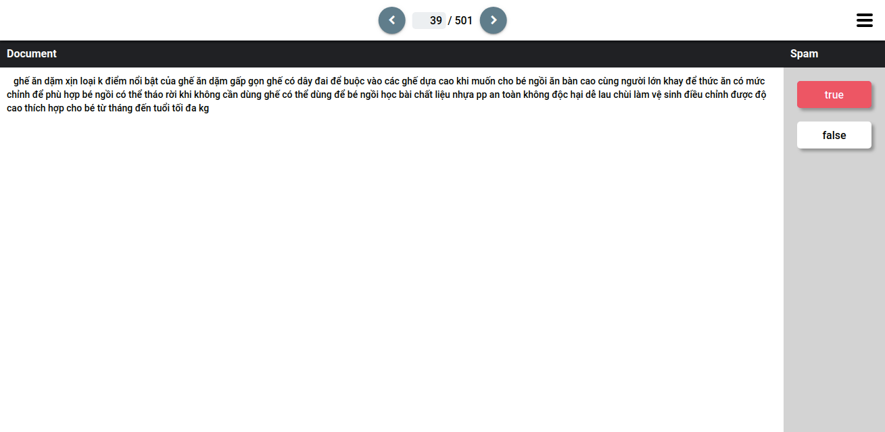

# EASY-LABEL PROJECT
Ease-label is designed for Machine Learning, Deep Learning projects to easily label data from dataset with friendly UI that help to increase productivity.

Features:
- Provides user interface to show each item from dataset with easy to read layout.
- Easily label data with provided buttons.
- Configurations are simple, initial configurating is fast.
- Support CSV files.

## Prerequisites
- Python3
- MongoDB
- Node.js

## HOW TO RUNS
- Open a terminal, run:
```
npm start
```
- Open another terminal, run:
```
python3 run.py
```

After a while, the UI is automatically opened in the default browser.

